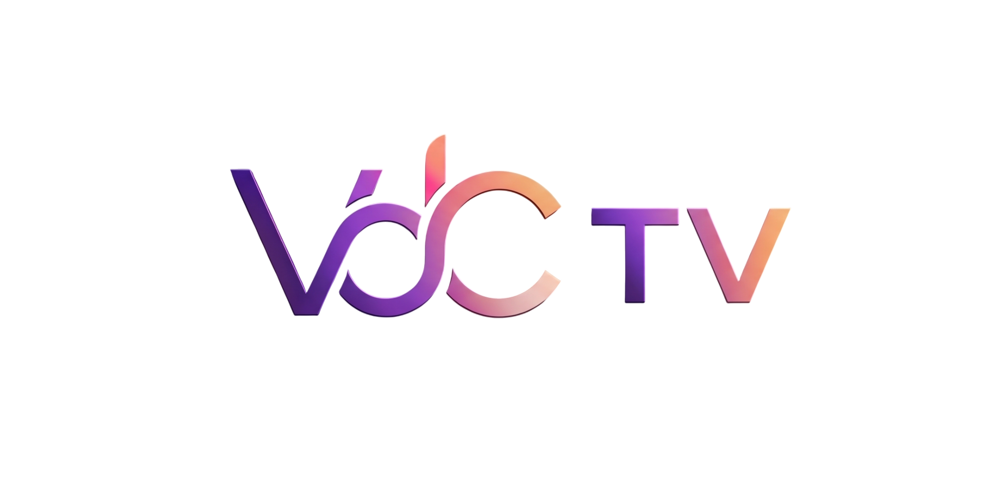
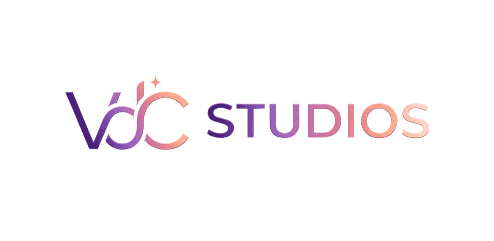

<<<<<<< HEAD
# VDC TV

VDC TV is a VdC Studios Android application for Jellyfin that provides a native user interface to browse and play movies and series.

=======


# VDC Studios
VDC Studios is a third-party Android application for Jellyfin that provides a native user interface to browse and play movies and series.

This project is a customized fork focusing on a clean, native experience for both phone and Android TV.
>>>>>>> b69d89e43a3035044e06a8a08f11960b3b6083e8

## Features
- **Completely native interface**
- **Dual Engine Support**: Choose between ExoPlayer and MPV for the best playback compatibility.
- **Android TV Support**: Fully optimized UI for big screens with remote control navigation.
- **Live Subtitle Downloads**: Download subtitles mid-playback and see them appear instantly in the selection menu.
- **Thumbnail View**: Support for high-quality server-side thumbnails in library views.
- **Offline playback / downloads**
- **Picture-in-picture mode**
- **Media chapters & segments** (Skip buttons, auto-skip)

## Playback Engines
### ExoPlayer
- Supported codecs: H.264, H.265, VP9, AV1, AC-3, DTS, etc.
- Seamless integration with Android system features.

### MPV
- High-performance engine with broad container support (mkv, mov, mp4, avi).
- Software decoding fallback for problematic hardware.
- Advanced subtitle rendering.

## Development
This application is built with Kotlin and Jetpack Compose.

<<<<<<< HEAD

## License
This project is licensed under the GPLv3 License.

VdC Tv is a project of VdC Studios

=======
### Building
To build the project yourself, use the included Gradle wrapper:
```bash
./gradlew assembleDebug voor de Debug
./gradlew assembleLibreRelease voor volledige app


## License
This project is licensed under the GPLv3 License.
>>>>>>> b69d89e43a3035044e06a8a08f11960b3b6083e8
